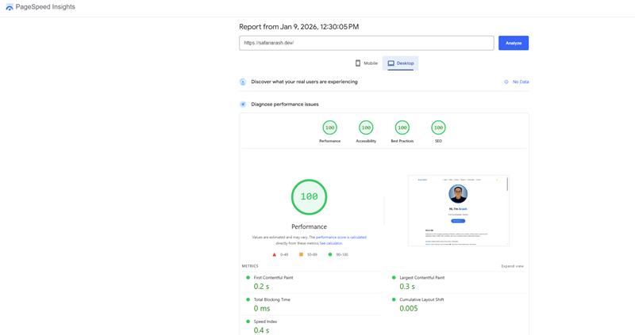

# 🚀 Arash Safari – Front-End Developer Portfolio

A high-performance, fully responsive personal portfolio showcasing production-ready frontend development with a strong focus on performance, accessibility, and clean UI.

**Live Website:** https://www.safariarash.dev

---

## 🧑‍💻 About Me

Hi, I’m **Arash Safari**, a Front-End Developer based in **Stockholm, Sweden**.

I build fast, accessible, and user-friendly web applications using modern frontend technologies.  
This portfolio reflects real-world frontend standards and performance-driven development.

---

## 🛠️ Tech Stack

- HTML5 (Semantic & Accessible)
- CSS3 (Responsive Design & Animations)
- JavaScript (ES6+) Dynamic content and interactive UI components.
- GitHub API (Dynamically fetching latest repositories.)
- Formspree (Serverless Contact Form)
- Performance(WebP imagery and asset optimization.)

---

## ⚡ Performance & Lighthouse Scores

Perfect Lighthouse scores on both Mobile and Desktop.

### 📱 Mobile

### 💻 Desktop

- Performance: **100**
- Accessibility: **100**
- Best Practices: **100**
- SEO: **100**

### Performance Optimizations

- Optimized Imagery: Fully converted to .webp for reduced payload.
- Visual Stability: Achieved zero layout shift (CLS ≈ 0.005).
- Asset Management: Minimal DOM size and deferred script execution.
- Clean Code: Removed deprecated APIs and redundant styles.

---

## 📬 Contact Form

Serverless contact form powered by **Formspree**.

## ✨ Key Features

- Fully responsive layout
- Accessible navigation & semantic HTML
- Dynamic content loading
- Modal-based project previews
- Light / Dark mode toggle
- Smooth animations & transitions
- Production-ready codebase

---

## 🌍 Deployment

- Hosted on GitHub Pages
- Domain: Custom domain configured via CNAME (safariarash.dev).
- Security: SSL/TLS enforced for secure communication.

---

## 👨‍💻 Author

**Arash Safari**  
Front-End Developer

- Location: Stockholm, Sweden
- Email: safari.arash@gmail.com
- GitHub: https://github.com/ArashSafarighouzhdi
- Portfolio: https://www.safariarash.dev

---

## ⭐ Notes

This project demonstrates:

- Production-level frontend architecture
- Performance optimization techniques
- Accessibility best practices
- Clean, maintainable, and scalable code

Feel free to ⭐ star the repository if you find it useful.
